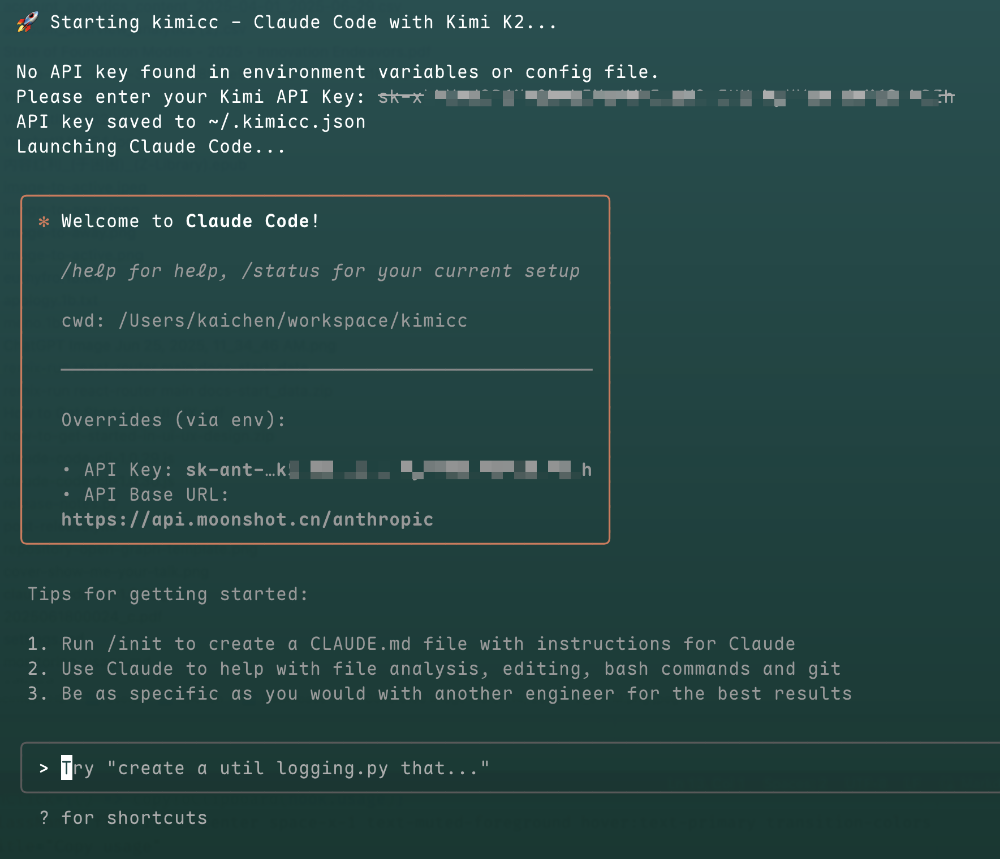

# KIMICC

一步命令 `npx kimicc` 使用 Kimi K2 运行 Claude Code。

## 为什么使用 Kimi K2 运行 Claude Code

1. Claude 由于特殊原因难以稳定订阅；
2. Claude 订阅价格相对于发展中国家的广大群众难以负担以及支付；
3. Kimi K2 是当前 Agentic 特性最高的开源模型，足以驾驭 Claude Code 这个系统；
4. Kimi K2 API 价格仅有 Claude 的 1/5 到 1/6，支持多种支付方式；
5. 让更多人体验最先进的开发工具，让厂商卷起来。

## 使用方式

- 第一步，访问 [开发者平台](https://platform.moonshot.cn/playground) 获取 Kimi API Key；
- 第二步，在你本地有 Nodejs 环境的前提下，运行 `npx kimicc` 安装并启动；
- 第三步，在安装后可使用 kimicc 直接启动，并在提示下输入 API Key。

启动后会提示你输入 API Key，下次就无需再次设置。

## 已知问题

- 本项目先在 Mac 上开发并测试，不保证 Linux 以及 Windows 系统运行，欢迎反馈问题以及提交 PR。

👏 欢迎遇到问题或想要更多功能提出 Issue。

## License

MIT. Kai<kai@thekaiway.com>
